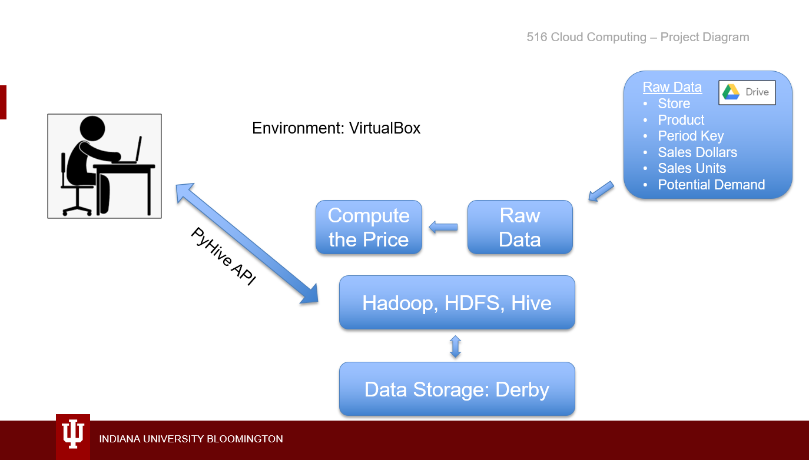
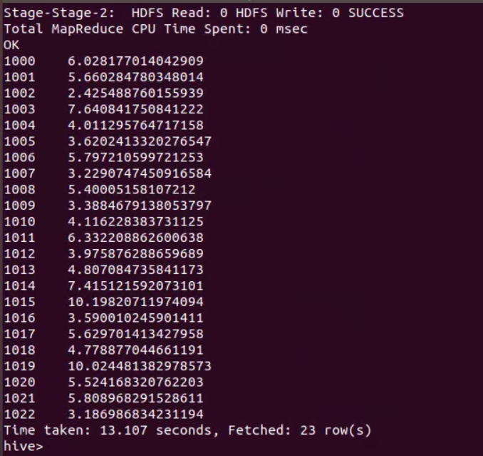

# Scalable Data Processing for Retail

| Brad Pope
| popebradleyt@gmail.com
| Indiana University
| hid: fa18-516-17
| github: [:cloud:](https://github.com/cloudmesh-community/fa18-516-17/blob/master/project-report/report.md)
| code: [:cloud:](https://github.com/cloudmesh-community/fa18-516-17/blob/master/project-code/README.sh)

**:mortar_board: Learning Objectives**

* Describe the unique data storage and compute needs of the Retail Industry
* Implement portions of a cloud computing environment that would meet those needs
* Describe the performance of the prescribed environment on a sample retail dataset
* Highlight some additional architecture opportunities outside the scope that would further help the Retail sector

---

Keywords: Hadoop, Hive, WebHCat, Java, Retail

---

## Introduction

As with other industries, the retail industry today is undergoing a major shift.  Traditional brick and mortar stores used to rely on practiced merchandising techniques such as printed flyers, television advertising, and low prices to drive traffic into stores.  Today, shoppers are electing for convenience more than ever before.  This is driving growth in a variety of time-saving Omni channel purchasing behaviors.  Shoppers are voting with their wallets to have more product shipped to their door and for more convenient services such as grocery pick-up.

In tandem with a more demanding shopper, there is also a fundamental shift in the sheer amount of data collected on the path taken to purchase products. For example:
* Shoppers now research and initiate more purchases from their smart devices.
* There are more shopper interaction data points captured in digital advertisements
* Social media posts can have an impact on brand sentiment and individual product sales
* E-commerce outlets sell and reselling products through a variety of channels

In short, there is new structured and semi-structured data available for retailers to leverage.

To survive in this changing landscape, retailers need to be open to change and use every advantage they have.  Unfortunately, as technology evolved, each retailer responded differently and implemented a piecemeal data strategy to accommodate data elements as they become available. This legacy approach does not scale and ultimately puts them at a competitive disadvantage. We offer a cloud-based highly scalable distributed architecture that will allow retailers to reliably process a variety of data and integrate new data sets as they become available.

## Dataset

In order to appreciate the storage and computational requirements, it is important to understand the idiosyncrasies of a retail data set.

Data available to retailers is heavily nuanced as each retailer collects and houses data in a different way.  There are a host of internal metrics required in the ordinary course of daily business.  In addition, there are a mounting number of external datasets now required to effectively compete.  All of this makes for a challenge when it comes to acquiring, blending and actually using the data.

Retailer generated data (Internal data): This is data that the retailer creates during the normal course of business.  This includes transactional data such as what product were sold in each store at any given time including what products sold together. At an operational level, it includes the purchase orders used to get more product to sell from suppliers, inventory levels in warehouses and stores. Operational data is also future looking with anticipated through merchandise forecasts.  There are other data sets that track what products should be on shelves, how much product should be there and where the product should go. In short, retailers internal data sets vary greatly in terms of the metrics gathered and how they are used which adds complexity.

*	Granularity describes the level of depth of a dataset.  On one side of the scale, transactional data sets are at a shopper, store, item, timestamp level of granularity and include important features such as what products are purchased together.  Retailers often make operational data available at the store, product, day or week levels of granularity.  For example, units per store per day is a normalized measure of how quickly a product sells in a given set of stores.
*	Frequency describes how often a dataset is refreshed.  Some measures are important operationally and refreshed continually.  Other datasets are more static.  For example, forecasts could be refreshed weekly, reference information like competitive stores could be updated monthly and exchange rates for planning purposes could be refreshed annually.
*	Latency describes how much of a lag exists with a data set.  For example, while a dataset may be updated daily it may have two or three-day latency to get it from the stores where the product is selling.  Often times, it takes that much time to flow it to the central repository for further processing and reporting.
*	Restatement or trickle data occurs when updated data becomes available for past time periods.  When this occurs processes need to be in place to remove previous data with the updates.  Controls or versions of data should be in place for critical numbers such as actual sales values that get reported to Wallstreet for their shareholders.

Externally generated data: Not all data that a retailer uses comes from their internal systems as it only gives partial insight to shoppers and competitors.  To supplement internal data, retailers are continually assessing shopper preferences.  In order to do this many subscribe to services offered by IRI, Nielsen, and InfoScout.  This type of data allows them to understand who their shoppers are and if they are getting their fair *share of wallet* or percent of purchases of each category were made in their locations.  It also allows them to see what other products those shoppers buy and which of their competitors those shoppers are purchasing them.  

There are several external sources of data that have recently entered the market.  
*	Social Media: Insights from social media have become highly sought after to understand and influence shopper sentiment.  
*	Omnichannel: Omnichannel and path to purchase data varies greatly and can hold insights as to how consumers shop for certain products and brands.  
*	E-commerce: Knowledge of purchases made online is desirable to understand which products have better potential to sell online.

The variety and amount of data available in the datasets make pulling and storing the data a challenge.  This challenge is exacerbated by the need to blend the vastly different internal and external data together.

### Dataset.  

Here is a description of the sample dataset:

*	Store – Values here represent individual stores.   The number of stores varies greatly by retailer.  The dataset included 300 stores.  Larger retailer chains can have more than 10,000 stores internationally.
*	Product – This is a proxy for a product UPC or Item Number.  Retailers will sell thousands of products in any given retail location.  For our purposes here 23 products were included.
*	Period_Key – Date information in a YYYYMMDD format.  Many retailer datasets have two years of history available.  This dataset contains daily data from 10/23/2015 through 10/15/2017 which equates to 723 unique dates.
*	Sales Dollars – US Dollars associated with the sales for each product, store and period.
*	Sales Units – Number of units sold for each product, store and period.
*	Potential Demand – Potential revenue associated with having the product available for sale (no out of stocks).

## Implementation

Diagram of the overall solution is shown in +@fig:RetailProjectDiagram.

{#fig:RetailProjectDiagram}

### Hadoop

Apache Hadoop for retailers was chosen for several reasons.  First, Hadoop's capabilities are well aligned with the needs of retailers.  According to the home page of the Hadoop project at Apache Software Foundation, *Apache Hadoop offers highly reliable, scalable, distributed processing of large data sets using simple programming models. With the ability to be built on clusters of commodity computers, Hadoop provides a cost-effective solution for storing and processing structured, semi and unstructured data with no format requirements* [@fa18-516-17-Hadoop].

First and foremost, the cost advantages associated with open source software should not be overlooked.  Retailers have razor thin margins.  There is stiff competition from online retails and a host of aggressive discount retailers such as Aldi, Family Dollar and Lidl with low-cost private label products.  In order to save cost and maintain their margin, saving money on infrastructure is critical for retailers.

Retailers also need reliable data processing and distribution at scale.  Operational data is the lifeblood of a retailer.  If the computer-assisted order system does not have reliable inventory, sales and forecast information from a store, it will not be able to issue purchase orders to suppliers and keep the product in stores for ongoing business. Rather than relying on the hardware to rely on redundancy and high-availability, Hadoop detects and handles failures at the application layer and delivers a high-availability service on top of a cluster of computers to avoid a whole system failure [@fa18-516-17-highavailablity].

The application layer also allows for adding more datasets as they become available which is a key retailer need.  The Hadoop framework scales from processing on a single server to thousands of machines and uses the computation and storage available on each. This ability to scale coupled with the flexibility to add new formats of semi and unstructured data is important new data is continually becoming available to retailers [@fa18-516-17-Hadoop].

### HDFS

The Hadoop Distributed File system (HDFS) is Hadoop's proven ability to distribute very large files on a cluster of commodity hardware [@fa18-516-17-commodityhardware].

For a retailer with thousands of stores and thousands of products capturing all of the data necessary results in petabytes of data.  In addition, data is constantly being created as products move in the supply chain, sell in the stores and forecasting and planning are continually being processed in the background.  HDFS accommodates these demands.

First, it is possible to store files of any size on HDFS.  The distributed file system breaks down files that potentially petabytes in size into smaller pieces or blocks and each piece could be stored on different machines if needed. In this system, an HDFS master node known as a NameNode and a slave node is called a DataNode. NameNodes maintain and manage all information about all files and directories stored on HDFS including the file system tree and metadata. DataNodes are the actual storage for the blocks. NameNode sends blocks to the DataNodes to store and DataNodes continuously report their status back including the list of blocks they are storing.  This makes it possible to store files of any size on a Hadoop cluster.

For this implementation, we are keeping the NameNode and the DataNode on the same VirtualBox with the set of sample data. As a future consideration, the DataNodes would be distributed across many servers.  In addition, to fully leverage HDFS, the retailer data would be stored in larger files instead of millions of smaller files resulting in the NameNode using less memory.

Commodity Hardware means using standard commonly used hardware without the need to specialized high-end systems. As discussed earlier, less cost is important for retailers so being able to use more common server configuration systems to build a reliable cluster with HDFS results is extremely important.

### Hive

>"Since its incubation in 2008, Apache Hive is considered the defacto standard for interactive SQL queries over petabytes of data in Hadoop. Data analysts use Hive to query, summarize, explore and analyze that data, then turn it into actionable business insight" [@fa18-516-17-apachehive].

Hive works well with HDFS because it organizes the data into databases, tables, buckets and clusters.  Partitioning and bucketing these tables allows for efficient storage and data retrieval.  This abstract structure allows the system to only load the relevant parts of the table during query processing.  Querying less data results in faster query execution times [@fa18-516-17-hiveorganization].

Just like in other industries, Retail IT professionals often have SQL skills so using the HiveQL which is very similar to SQL would be beneficial for adoption.  In addition, the hive structure will do an effective job pruning the large datasets that a retailer has to just the relevant measures and attributes needed in a report or analysis.

Since this is the case, SQL against Hive to compute the average price was leveraged here.  As a future consideration with a larger dataset more of the Hive partitioning and bucketing features should be leveraged.

### Data Storage

Hadoop and HDFS require a database and, given the smaller sample dataset, Derby was implemented.  Derby has a small footprint and relatively straightforward to install, deploy, and use.  It also supports a client server model and is based on Java which is already a requirement of Hadoop [@fa18-516-17-apachederby].

As unstructured data is added to Hadoop and HDFS, a future consideration is to use Azure blob storage with HDInsight.  Azure blobs are capable of storing a variety of types of files from documents to database backups.  Similar blobs are stored in containers.  Both containers and blobs do not have hard size limitations.

>"Azure Blob storage can be accessed from Hadoop (available through HDInsight). HDInsight can use a blob container in Azure Storage as the default file system for the cluster. Through a Hadoop distributed file system (HDFS) interface provided by a WASB driver, the full set of components in HDInsight can operate directly on structured or unstructured data stored as blobs" [@fa18-516-17-azureblob].

### API
There needs to be a way to access the data through an API.  As a simpler implementation with python, PyHive is the logical API for illustrative purposes with Hive.  Per the Python Software Foundation, Pyhive is "a collection of Python DB-API and SQLAlchemy interfaces for Presto and Hive" [@fa18-516-17-pyhive].

Since the Hadoop, HDFS and HIVE implementation will get complex as different types of data are added, a future consideration is to use WebHCat.  WebHCat is a REST API for HCatalog which is the storage management layer for Hadoop. WebHCat also works well with HDInsight making it ideal for an Azure Blob Microsoft implementation.  In addition it can interact with more functionality of Hadoop than PyHive.

## Benchmark

Using the components above, the calculation for the average price was run on VirtualBox on a local computer with 8MB of RAM.  The query itself took 13.1 seconds.

### Query and Results
Select Item_Key,(POSSales/POSQty) AS AverageRetail FROM (Select Item_Key, sum(POSSales) AS POSSales, sum(POSQty) AS POSQty From retaildata GROUP BY Item_Key) byitem ORDER BY Item_Key;

The query was run for the average price by store as shown here +@fig:RetailAveragePrice.

{#fig:RetailAveragePrice}

## Conclusion

We've described how retailer data needs are continually expanding. In order to meet those needs, we've shown that it will take a reliable, scalable architecture at a lower price point.  The cloud computing model delivered through a combination of Hadoop, HDFS, and Hive described above meets those needs.

We've successfully implemented portions of this environment and illustrated the performance on a sample retail dataset.  In addition, several future considerations were called out that will enhance and scale the architecture as additional complexity is added.
